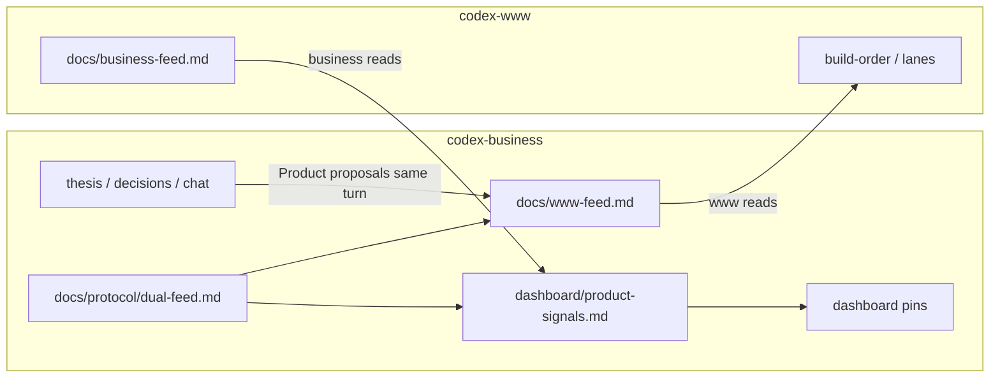

# Dual feed — business half

## Cross-silo chain

| | |
|--|--|
| **Order** | **1. this plan** → **2. dual-feed-www** (aligned 2026-07-20) |
| **This plan** | [`codex-business/.cursor/plans/2026-07-20-dual-feed-business.plan.md`](2026-07-20-dual-feed-business.plan.md) |
| **Sibling (www)** | [`codex-www/.cursor/plans/2026-07-20-dual-feed-www.plan.md`](/mnt/DataStore/Ventures/project-codex/codex-www/.cursor/plans/2026-07-20-dual-feed-www.plan.md) |
| **This plan owns** | Dual-feed **contract** doc, business harvest habit, `product-signals` pin, www-feed schema notes for reverse feed, cursor-shared dual-feed paragraph |
| **This plan must not** | Create or edit `codex-www/docs/business-feed.md`, www AGENTS/rules/pins, or www plans |
| **Unlocks** | Www dual-feed plan implements `business-feed.md` against locked `docs/protocol/dual-feed.md` |
| **Alignment habit** | When this plan’s contract/schema changes, note drift for www session (www-only cannot edit business; business-only cannot edit www). Read sibling before Build. |

## Plain English

| | |
|--|--|
| **What this is** | Formalize the **business half** of two-way handoff: we already push to `www-feed.md`; we also need a locked contract for what www writes back, and habits so agents keep feeds + pins fresh without Brian babysitting. |
| **What you get** | `docs/protocol/dual-feed.md` + reconciled AGENTS/rule/pins + clear Ready/schema for www’s `business-feed.md`. |
| **Why it matters** | Not everything www builds goes through strategy — but ships, stumbles, and money-impacting learnings must flow back automatically. |
| **Your part** | Say **Build** on this plan first (business silo), then **Build** `dual-feed-www` in the www silo. |

## Already present (reconcile — do not redo blindly)

From 2026-07-20 chat (pre-plan):

- `docs/www-feed.md` — Product proposals, Ready row for reverse feed, dual-feed note
- `.cursor/rules/www-feed.mdc` — dual-feed + pin refresh
- `AGENTS.md` — resume read of www `business-feed.md`
- `.cursor/dashboard/product-signals.md` — harvest stub
- `cursor-shared/README.md` — dual-feed table

**Build still required** to lock `docs/protocol/dual-feed.md` and point habits at it. Treat prior edits as partial progress. Plan registration + sibling path done at align.

## Locked decisions (aligned 2026-07-20)

1. **Www owns** `/mnt/DataStore/Ventures/project-codex/codex-www/docs/business-feed.md` — business **reads only**.
2. **Business owns** `docs/www-feed.md` — www **reads only**.
3. **Brian does not maintain feeds** — writing silo updates its feed **same turn**; reading silo harvests and refreshes **its** pins when it sees new signals.
4. **No shared registry / no hub-work-queue clone** — markdown + agent habits only.
5. **Product proposals** on `www-feed.md` are the intentional path for “discussed in business → flesh out in www” (contract documents the habit). Www adopts habit-only — **no** Pending Product proposals mirror table (lanes still mirror).
6. **Reverse-feed content filter:** shipped (user/commercial meaningful), stumbles (cost/rights/timeline/feasibility), learnings that change money/positioning, asks-back. Not routine eng noise.
7. **`business-feed.md` schema** (www implements): Meta | Shipped | Stumbles | Learnings | Asks-back | Changelog — table columns as in www sibling Solution A (locked on www full review).
8. **Www rule shape:** extend existing `www-pins.mdc` (no second alwaysApply file).
9. **Build order:** **1. dual-feed-business** → **2. dual-feed-www** (contract SoT before reverse file).

## Problem

One-way `www-feed` is insufficient. Www can ship product-only work; business still needs return signals. Partial habits exist but there is no locked schema/contract plan pair, and www has not created `business-feed.md` yet (write-scope forbids business from doing it).

## Solution

### A. Contract doc (this Build)

Create **`docs/protocol/dual-feed.md`** with:

| Section | Content |
|---------|---------|
| Direction table | www-feed vs business-feed paths, who writes/reads |
| `www-feed.md` sections | Meta, Direction snapshot, Priorities, Ready, **Product proposals**, Lane proposals, Open questions, Out of scope, Changelog |
| `business-feed.md` sections (www implements) | Meta, Shipped, Stumbles, Learnings, Asks-back, Changelog |
| Triggers | When each side must write; same-turn pin refresh lists |
| Non-goals | No cross-vault writes; no Python queue |

### B. Reconcile business habits

- Point `www-feed.mdc`, `AGENTS.md`, `product-signals.md` at the contract
- Ensure `www-feed.md` Ready row + short “expected reverse schema” pointer remain accurate
- Refresh `strategy-queue.md` / sector pins if contract changes wording

### C. Sibling www plan (Build #2 — www silo)

Www plan creates `docs/business-feed.md` matching this contract, extends `www-pins.mdc`, AGENTS write habit, pin refresh on www side.

## Verification

- [x] `docs/protocol/dual-feed.md` exists with both schemas + triggers (incl. www table columns)
- [x] Business AGENTS + rule + product-signals point at contract; no `codex-www/` files edited
- [x] `www-feed.md` Meta/Changelog updated; Ready reverse-feed row cleared after www Built
- [x] `cursor-shared/README.md` dual-feed paragraph matches contract
- [x] This plan on `dashboard/build-order.md`; sibling path + Order 1→2 locked at align
- [x] After www Builds: clear/update Ready row for reverse feed; harvest into product-signals

## Build notes (2026-07-20)

Shipped business half. Www **dual-feed-www** Built same day; harvest completed (Ready cleared, product-signals updated, foundation baseline echoed on www-feed).

## Out of scope

- Creating `codex-www/docs/business-feed.md` or any www pins/rules
- Product feature Builds (P1–P6) — separate www plans after feed pair is live
- Foundation proposal/SWOT drafting
- Editing the www plan file from this silo (note Order lock for www session)

## Align notes (2026-07-20)

| Check | Result |
|-------|--------|
| Sibling path | Confirmed `2026-07-20-dual-feed-www.plan.md` |
| Schema sections | Match (Meta / Shipped / Stumbles / Learnings / Asks-back / Changelog) |
| Content filter | Match |
| Product proposals | Www habit-only, no mirror table — accepted into business locked decisions |
| Rule shape | Www extends `www-pins.mdc` — accepted |
| Build order | **1 business → 2 www** (contract before reverse file) |
| Www Cross-silo Order cell | Still says TBD in www plan — **www session should set Order to `1. dual-feed-business → 2. this plan`** (business cannot edit www) |

## Cross-check notes

- Upstream one-way feed already Built (`strategy-www-feed`). This plan **extends** it; does not replace it.
- Www queue/lanes already Built — www dual-feed plan adds outbound write habits alongside existing feed-read.
