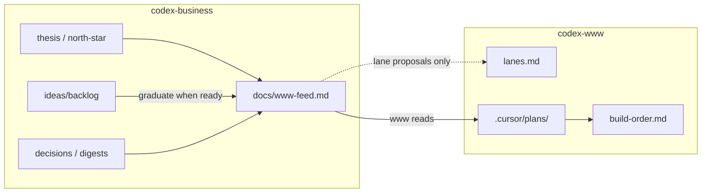

# Strategy → product feed (`docs/www-feed.md`)

## Cross-silo chain

| | |
|--|--|
| **Order** | **1. this plan** → **2. www queue / lanes** |
| **Sibling** | [`codex-www/.cursor/plans/2026-07-20-www-queue-lanes.plan.md`](/mnt/DataStore/Ventures/project-codex/codex-www/.cursor/plans/2026-07-20-www-queue-lanes.plan.md) |
| **This plan owns** | `docs/www-feed.md`, business AGENTS/rule, cursor-shared contract paragraph |
| **This plan must not** | Create or edit `codex-www/.cursor/` pins (`build-order.md`, `lanes.md`, plans) |
| **Unlocks** | Www queue/lanes Build (pins read the feed; lane proposals stay proposals until www adopts) |
| **Alignment habit** | When this plan’s contract changes (sections, triggers, handoff rules), update the sibling plan’s Cross-silo chain / Depends same turn if the www silo (or Ventures root) is in write scope — otherwise note the drift for the www session. Read sibling before Build. |

After www pins exist, **product build sequence SoT** is `codex-www/.cursor/build-order.md` (lists this plan as upstream prerequisite by path). The feed is **not** a second queue.

## Plain English

| | |
|--|--|
| **What this is** | A single markdown file in the business vault that tells www builders what strategy wants next — without business agents touching www pins. |
| **What you get** | `docs/www-feed.md` + a short agent habit (AGENTS + rule) so the feed stays current when direction changes. |
| **Why it matters** | Www owns `build-order.md` / `lanes.md` / plans; business owns thesis and ideas. The feed is the only intentional bridge. |
| **Your part** | Say **Build** on this plan when ready (before the www queue/lanes plan). |

## Locked decisions (2026-07-20 full review)

1. **Ready-for-planning depth:** pointer + short brief (title, why now, 2–4 bullets, links to backlog/decision/digest). Not pointer-only; not a full mini-spec dump.
2. **cursor-shared pointer:** include in this Build — one paragraph naming the handoff **and** cross-silo chain contract (mutual plan links; www `build-order.md` owns product sequence); feed content stays in business.
3. **Graduation gate:** Brian explicit only (e.g. “graduate X to www-feed” / “ready for a www plan”). Strategy agents do **not** auto-graduate; backlog status alone does not move items into Ready.
4. **Open questions seed:** three product-gating north-star items only (SKU, supply, fiction-first). Entity/LLC stays out of the feed’s product-blocking section.

## Locked context (do not re-litigate)

Already decided on the www side:

- Product pins live only under `codex-www/.cursor/`: `build-order.md`, `lanes.md`, `plans/`
- No hub-work-queue Python clone; agents update pins same-turn
- Business must **not** edit `codex-www/`; www must **not** own strategy canon

## Problem

Strategy canon (`thesis`, `north-star`, digests, backlog, decisions) lives in `codex-business/`. Www builders need a **short, current** signal of priorities and “ready for a www plan” items — without cloning strategy into www or inventing a registry service.

## Solution

One canonical handoff file:

**`codex-business/docs/www-feed.md`**

- Business agents **write** it (same turn when strategy affects product).
- Www agents **read** it (when opening product planning / lane work).
- Lane ideas in the feed are **proposals** until www adopts them into `lanes.md`.
- Ideas stay in `docs/ideas/backlog.md` until Brian explicitly graduates them into the feed’s Ready section.

## Source of truth vs feed summary

| Doc | Role | Into `www-feed.md`? |
|-----|------|---------------------|
| `docs/thesis.md` | Locked product job / rejects / wants | **Summary** — 3–6 lines “Direction snapshot”; link back |
| `docs/north-star.md` | End-goal + monetization lean + open questions | **Summary** — only product-relevant open questions / constraints www must respect |
| `docs/ideas/backlog.md` | Idea stubs (stay here) | **Only graduates** → Ready for planning; never wholesale copy |
| `docs/decisions/` | ADR locked choices | **Link + one-line impact** when a decision changes product scope |
| `docs/conversations/*` | Digests / narrative | **Not copied**; feed may cite “see digest §X” for context |
| `docs/vision.md` / protocol / dual-account | Ops / seat / env | **Out of feed** unless a choice blocks product planning |
| `codex-www/.cursor/lanes.md` | Adopted website lanes | **Www owns**; feed only proposes |
| `codex-www/.cursor/build-order.md` | What www builds | **Www owns**; feed never writes |

**Rule of thumb:** Canon stays where it is. The feed is a **curated projection** for builders — short enough to skim in one screen, linked enough to go deep.

## Feed sections (implement on Build)

Create `docs/www-feed.md` with these sections (headings fixed; content evolves):

1. **Meta** — `Last updated: YYYY-MM-DD` + one-line “updated because …”
2. **Direction snapshot** — condensed thesis + north-star constraints www must not violate (companion ≠ substitute; paid Gemini for book text; enhancement-to-owned framing; N-book metering lean — pointers, not essays)
3. **Priorities (now)** — ordered list of what strategy wants product attention on *this cycle* (can be empty / “env only — no product plan yet”)
4. **Ready for planning** — graduated items only. Each entry:
   - Title
   - Why now (1–2 sentences)
   - Brief (2–4 bullets)
   - Links: backlog row and/or decision and/or digest anchor
   - Suggested lane (optional proposal string — e.g. `ai-module`) — **proposal until www adopts**
5. **Lane proposals** — optional table: proposed lane name / why / status (`proposed` | `adopted in www` | `dropped`). Www adoption is recorded here as a note after Brian/www confirms; business still does not edit `lanes.md`
6. **Open questions that block product** — subset of north-star / digest questions that would change a www plan if answered; drop questions that are pure venture/ops (e.g. LLC timing) unless they gate a Build
7. **Out of scope / do not build yet** — parked or explicitly deferred (e.g. topic video outlinks) so www doesn’t invent from backlog stubs
8. **Changelog (short)** — last ~5 feed edits, one line each (required; keep tiny)

### Initial seed (on Build)

Populate from current vault state without inventing new product scope:

- Direction snapshot from `thesis.md` + rights/monetization lean from `north-star.md`
- Priorities: honest “no Ready items yet” / continue product planning when Brian says — idea-gen still paused per digest
- Ready for planning: **empty** until Brian graduates something (do not auto-graduate backlog stubs)
- Lane proposals: empty or 1–2 illustrative proposals only if strategy chat already named lane-shaped work; otherwise empty table with header only
- Open questions: three product-gating from north-star (SKU, supply, fiction-first). Do **not** seed entity/LLC here.
- Out of scope: parked backlog rows (topic videos, location tie-ins)
- Changelog: required (last ~5 feed edits, one line each) — not optional

## Same-turn update triggers

Business agents update `docs/www-feed.md` **in the same turn** when any of these happen:

| Trigger | Feed action |
|---------|-------------|
| Thesis / north-star lean changes | Refresh Direction snapshot (+ Meta date) |
| New or changed product-affecting decision | Add link + impact under snapshot or Open questions; Changelog line |
| Brian explicitly says an idea is ready for a www plan (e.g. “graduate X to www-feed”) | Move/graduate into Ready for planning (pointer + brief); leave stub in backlog with status note e.g. `ready → www-feed`. Agents do not auto-graduate. |
| Priority reorder for product work | Rewrite Priorities (now) |
| New lane-shaped product area discussed | Add/update Lane proposals (`proposed`) |
| Www adopts a proposed lane (Brian confirms or www silo reports) | Mark proposal `adopted in www` in feed only — **still do not edit** `codex-www/.cursor/lanes.md` |
| Idea parked / killed | Add to Out of scope; remove from Ready if present |
| Conversation digest that changes direction | Summarize into snapshot / priorities; link digest — do not paste the digest |

**Do not** update the feed for pure seat/protocol/env chatter, research stub files with no product implication, or idea brainstorming while idea-gen is paused (unless Brian graduates something).

## Agent / rule changes (this silo only)

### `AGENTS.md`

- Add resume step: read `docs/www-feed.md` when work may affect product (after thesis/north-star/backlog).
- Add explicit habit: when strategy changes affect the product → update `www-feed.md` same turn; **never** write `codex-www/` pins or plans.

### New rule (thin)

e.g. `.cursor/rules/www-feed.mdc` (`alwaysApply: true`):

- Canonical handoff = `docs/www-feed.md`
- Same-turn update on product-affecting strategy changes
- Never edit `codex-www/`
- Lane lines in feed are proposals until www adopts
- Graduate backlog → Ready only when Brian says so explicitly

### `cursor-shared` (include)

One short paragraph in `cursor-shared/README.md` (Silo map / protocol section), contract only:

- Business owns strategy canon + `codex-business/docs/www-feed.md`
- Www owns pins under `codex-www/.cursor/` (`build-order.md`, `lanes.md`, plans)
- Www agents **read** the feed before product planning; business agents **never** write www pins
- Feed lane names are proposals until `lanes.md` adopts them
- Cross-silo plan chains use **mutual sibling links** in each plan; after pins exist, **www `build-order.md`** owns product sequence (may list business plans as upstream prerequisites by path). No shared registry file / no hub-work-queue clone.

Skip a phrases.md clutter entry unless a one-liner helps; README is enough.

**Out of scope for this Build:** editing `codex-www/` (www silo owns queue/lanes plan + AGENTS “read www-feed” note).

## Out of scope (this plan)

- Implementing any www pins, lanes, or product plans
- Hub-work-queue / Python registry
- Auto-sync, CI, or watchers
- Re-opening idea-gen or graduating backlog items without Brian
- Re-litigating Blinkist / companion thesis

## Acceptance criteria

- [x] `docs/www-feed.md` exists with the sections above and honest initial seed (Ready empty unless Brian graduated something in-chat at Build time)
- [x] `AGENTS.md` lists the feed in Resume + same-turn / never-write-www habit
- [x] Thin business rule exists and points at the feed
- [x] If default held: `cursor-shared/README.md` has one-paragraph strategy↔www handoff contract
- [x] No files under `codex-www/` modified by this Build
- [x] Ideas backlog remains SoT for stubs; Ready section only has graduated items

## Build notes

- Write-scope: `codex-business/` + optional `cursor-shared/` only
- Prefer plain git in Ventures when Brian asks to commit; no hub `git-commit.sh` ceremony
- Mark plan todos done as phases finish

## Review notes (2026-07-20 full review — internal)

Cross-check only (no CP1 Bugbot — plan does not touch `scripts/`; hub gate cannot resolve Ventures plan paths). Sibling www-queue-lanes plan aligned; cited vault paths exist; `docs/www-feed.md` correctly absent until Build. Open decisions → AskQuestion / Consult; fold picks into plan body on revise or Build.

| Topic | Note |
|-------|------|
| Ready depth | **Locked:** pointer + short brief |
| cursor-shared | **Locked:** include one paragraph in this Build |
| Graduation gate | **Locked:** Brian explicit only |
| Open questions seed | **Locked:** three product-gating (SKU, supply, fiction-first); entity out |
| Changelog | **Locked:** required (last ~5 lines) |
| Lane proposals seed | Keep empty at Build — www starter lanes are www-owned, not feed proposals |
| Dual dashboard | Keep `www-feed.md` as product handoff only vs any Brian-facing strategy-queue |
| Sibling unlock | Www Build Depends on feed file existing; this plan must not edit www pins |
)
