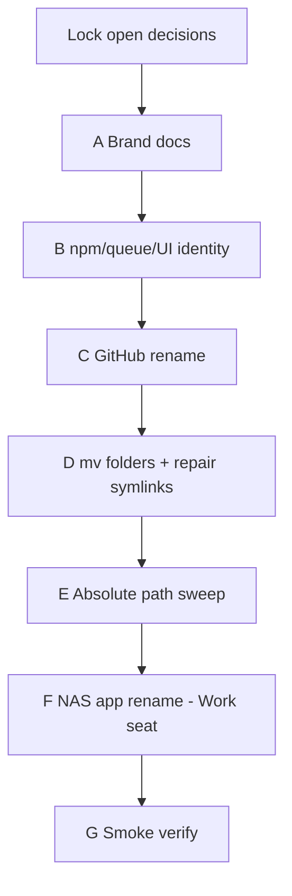

# Bookfellow rename (Project Codex → Bookfellow)

**Archived 2026-07-21** — Built A–G. Living path: `.cursor/plans/archive/2026-07-21-bookfellow-rename-cutover.plan.md`.

## Plain English

| | |
|--|--|
| **What this is** | A full rename so the venture matches **Bookfellow** / **bookfellow.io** — not just marketing copy. Folders you open, the GitHub repo, the NAS lab app, and package names all move. |
| **What you get** | One clear name everywhere that matters day-to-day. Homelab **Codex** (Docking Bay) stays Codex. |
| **Why it matters** | “Project Codex” was temporary. Leaving old paths means agents and you keep opening the wrong mental model. |
| **Your part** | Decisions are locked. If you want execution, say **Build** and we’ll do it in phases (different seats — one phrase cannot finish all seats). Close Cursor folders before the filesystem move. |

## Review notes (2026-07-21 full review — folded)

Internal CP1 + cross-check; revised phases below. Not build approval.

| Finding | Plan change |
|---------|-------------|
| `:4003` conflict if new app before old stop | Phase F: **stop/remove `projectcodex` first**, then create `bookfellow` |
| Hub still hardcodes `project-codex` paths | Phase E adds **hub half** (venture pointers) even if F deferred |
| Queue rename before NAS redeploy splits producers/consumers | Phase B split: copy/UI/package rename first; **queue + health rename only inside cutover window** |
| `.husky/pre-commit` hardcodes `codex-www` | Phase D step for husky |
| Lab Postgres wipe vs migrate not a forced decision | Locked decision #5: fresh `bookfellow_pgdata` |
| `docs/products/codex.md` points at old venture path | Update **path pointer only** — do not rename Docking Bay Codex product |
| Phase G missing queue smoke | Add `/api/queue/smoke` (double-dispatch / reclaim) |
| Multi-seat | Explicit: business / www / Ventures / Work each need their own execute window |
| Reopen-before-sweep hazard | Reopen silos only after venture path sweep is complete enough to avoid broken feed/rule pointers |
| Bare `mv` loses rename history | Use `git mv` from monorepo root where practical |
| Hub living plans can still point at old paths | Sweep `home/agent/.cursor/plans/` venture references in Work seat |
| TrueNAS network / ports docs can lag | Update network names and `ports-in-use.md` during hub cutover |

## Cross-silo / seat ownership

| Phase | Who executes | Workspace to open |
|-------|--------------|-------------------|
| A Brand docs (remaining) | Business silo | `codex-business/` **then** `bookfellow/bookfellow-business/` |
| B Code identity | Www silo | `codex-www/` → `bookfellow/bookfellow-www/` |
| C GitHub rename | Ventures root or monorepo root | `/mnt/DataStore/Ventures` or monorepo |
| D Filesystem move | Ventures root (host shell) | Close all silo workspaces first |
| E Path sweep | Business + www (split) | New silo paths |
| F NAS app | **Work / hub** seat | `homelab-personal` — compose-live, secrets, `compose_live.py` |
| G Verify | Www + hub | Lab `:4003` |

**Write-scope reminder:** From a business-only workspace you may only edit `codex-business/`. Www code, Ventures root `AGENTS.md`, and hub NAS files need their seats.



## Target names (locked)

| Current | Recommended target |
|---------|-------------------|
| `/mnt/DataStore/Ventures/bookfellow/` | `/mnt/DataStore/Ventures/bookfellow/` |
| `codex-business/` | **`bookfellow-business/`** *(locked)* |
| `codex-www/` | **`bookfellow-www/`** *(locked)* |
| GitHub `brian-wenger-atx/project-codex` | `brian-wenger-atx/bookfellow` |
| npm `project-codex` / `@project-codex/*` | `bookfellow` / `@bookfellow/*` |
| BullMQ `projectcodex-jobs` | `bookfellow-jobs` |
| Health `projectcodex-web` | `bookfellow-web` |
| TrueNAS app / compose `projectcodex` | `bookfellow` |
| Images `projectcodex-web:p4` / `projectcodex-worker:p3` | `bookfellow-web:…` / `bookfellow-worker:…` |
| Secrets `secrets/projectcodex.env` | `secrets/bookfellow.env` |
| Hub doc `docs/apps/projectcodex.md` | `docs/apps/bookfellow.md` |
| LAN port `:4003` | **Keep** (no need to change) |
| Domains `bookfellow.io` + `.cc` | Already owned — DNS later (not this plan) |

**Locked layout (Brian 2026-07-21):**

```text
/mnt/DataStore/Ventures/
  bookfellow/                      # monorepo git root
    bookfellow-business/           # strategy silo (was codex-business)
    bookfellow-www/                # product silo (was codex-www)
    AGENTS.md / GIT.md / package.json / .husky /
  cursor-shared/                   # unchanged — shared across ventures
```

Prefixed silo names so future ventures (`edgebook`, etc.) can sit alongside without ambiguous `business/` / `www/` at Ventures root.

---

## Inventory (2026-07-21 — thorough, not exhaustive line dump)

### A. Git / monorepo root (`/mnt/DataStore/Ventures/bookfellow`)

| Item | Notes |
|------|-------|
| Remote | `https://github.com/brian-wenger-atx/project-codex.git` (fetch+push) |
| `package.json` name | `project-codex`; scripts `--dir codex-www` |
| `README.md`, `GIT.md`, `AGENTS.md` | Project Codex framing |
| `.husky/pre-commit` | Likely references `codex-www` |

### B. Business silo (`codex-business/`)

| Cluster | Examples |
|---------|----------|
| Scope rules | `.cursor/rules/codex-business-scope.mdc`, `www-feed.mdc` (absolute www path) |
| Dual-feed | `docs/protocol/dual-feed.md`, `docs/www-feed.md` absolute reverse-feed path |
| Pins | `strategy-queue.md`, `build-order.md`, `product-signals.md`, `ops.md` |
| Plans | Built plans with absolute `…/project-codex/…` sibling links |
| Protocol | `docs/protocol/project-codex-email-cursor-setup.md` (rename file optional) |
| Partial brand lock already | thesis, vision, north-star, naming lean, README, dual-account — **incomplete vs this plan** |

### C. Www silo (`codex-www/`) — **www seat only**

| Cluster | Examples |
|---------|----------|
| Packages | `@project-codex/web`, `@project-codex/queue-contracts`; root `codex-www` |
| Queue | `QUEUE_NAME = "projectcodex-jobs"` (TS + generated Python + gen script) |
| UI / health | layout/page/nav “Project Codex”; health `service: "projectcodex-web"` |
| Docs | `README`, `docs/stack.md`, `docs/runbooks/containers.md` (18+ hits), `business-feed.md` |
| Rules | `codex-www-scope.mdc` (NAS carve-out `projectcodex`), pins, dual-feed absolute paths |
| Lab | Dockerfiles / compose refs via hub; `.env.example` |

### D. Ventures + cursor-shared

| Path | Notes |
|------|-------|
| `/mnt/DataStore/Ventures/AGENTS.md` | Silo map + “Resume Project Codex” |
| `cursor-shared/README.md` | Dual-feed table + silo paths |
| `cursor-shared/AGENTS.md` | Brian facts still say Project Codex |
| `cursor-shared/changelog.md` | Historical Project Codex entries — **leave as history** |

Symlinks today (relative — survive if depth unchanged):

- `codex-business/.cursor/rules/shared` → `../../../../cursor-shared/rules`
- `codex-business/.cursor/skills` → `../../../cursor-shared/skills`
- `codex-www/.cursor/rules/shared` → `../../../../cursor-shared/rules`

**Risk:** If silo depth changes (e.g. drop nesting), repair with `ventures-cursor-shared-ensure.sh`.

### E. Hub / NAS (Work seat — **must not edit from Ventures business-only**)

| Artifact | Path |
|----------|------|
| Compose | `home/agent/compose-live/projectcodex.yaml` (+ `.meta.yaml`) |
| App doc | `home/agent/docs/apps/projectcodex.md` |
| Secrets | `home/agent/secrets/projectcodex.env` |
| Registry | `scripts/compose_live.py` keys `"projectcodex"` |
| Ports | `docs/server/ports-in-use.md` (`:4003`, redis/pgb/pg loopbacks) |
| Apps index | `docs/apps/README.md` |
| Guide | `docs/ventures/project-codex-email-cursor-setup.md` |
| Product note | `docs/products/codex.md` = Docking Bay Codex product stays; **update venture path pointer** (E2) |
| Changelog / completed-builds | Historical “Project Codex” — leave |

### F. Do **not** rename

| Keep | Why |
|------|-----|
| Homelab **Codex** / Docking Bay `/codex` | Different product |
| Hub Codex **product** docs/runbooks (name + Docking Bay surface) | Homelab — but update **venture path pointers** inside them (Phase E2) |
| Port `:4003` | Stable lab address |
| Domains (already owned) | DNS/hosting is cutover later |
| Archived plan **filenames** | Optional pointers only; rewriting history is noise |
| Past changelog dates | History |

---

## Phases (executable)

### Phase 0 — Lock decisions (Brian) ✅

All five locked 2026-07-21 (see table at bottom). Do not start D until Cursor closed; do not start F until images/queue ready for same-window cutover.

### Phase A — Brand / strategy strings (business silo)

**Seat:** business. **Paths still `project-codex` until D.**

1. Finish dashboard + remaining docs that still say “Project Codex” as *current* name (strategy-queue, ops, dual-feed prose, AGENTS resume wording).
2. Keep one explicit “formerly Project Codex” note in naming lean / thesis name map.
3. Update `www-feed.md` Meta: rename plan path + “paths still migrating.”
4. **Do not** rewrite entire conversation digests — add a one-line supersede if needed.

**Done when:** Living strategy pins say Bookfellow; no pin implies Project Codex is the live brand.

### Phase B — Code / package identity (www silo)

**Seat:** www. Split into **B1 pre-cutover** and **B2 cutover-only** so the live lab never runs mixed queue identities.

**B1 — safe before cutover**

1. Rename packages `@project-codex/*` → `@bookfellow/*`; root package names → `bookfellow` / `bookfellow-www`.
2. Update all `pnpm --filter` scripts, `transpilePackages`, lockfile via `pnpm install`.
3. UI chrome (layout, sidebar, mobile nav, lab placeholder HTML) → **Bookfellow**.
4. Update www `docs/runbooks/containers.md`, `stack.md`, `README`; note NAS slug “pending rename” until F.

**B2 — same cutover window as F**

5. Change `QUEUE_NAME` → `bookfellow-jobs`, health `projectcodex-web` → `bookfellow-web`, regenerate Python (`pnpm gen:queue`), and build images for the F cutover.
6. Do **not** deploy B2 alone while `projectcodex` is still the live app. If cutover slips, keep `projectcodex-jobs` / `projectcodex-web` in the running lab until F resumes.

**Done when:** B1 lands cleanly, and B2 queue/health strings match the app that is actually running on `:4003`.

### Phase C — GitHub repo rename ✅

**Seat:** Ventures / monorepo root.

1. **Remote rename done (Brian):** GitHub `project-codex` → `bookfellow`.
2. **Local origin updated (2026-07-21):** `git remote -v` → `https://github.com/brian-wenger-atx/bookfellow.git` (fetch/push verified via `ls-remote`).
3. Updated `GIT.md`, root `README.md`, root `AGENTS.md`, root `package.json` name, www `docs/git.md`, www `AGENTS.md` git line.
4. Old GitHub URL should redirect (GitHub rename-in-place).

**Done when:** `git remote -v` shows `bookfellow`; push/pull works. ✅

### Phase D — Filesystem move ✅ (2026-07-21)

1. Host `mv` `…/project-codex` → `…/bookfellow` (repo root cannot `git mv` itself); then `git mv` silos → `bookfellow-business` / `bookfellow-www`.
2. Fixed monorepo `package.json` (`--dir bookfellow-www`) + `.husky/pre-commit` (soft-skip if gen:queue/tsc broken).
3. Symlinks `shared` / `skills` still resolve (same relative depth).
4. Updated `/mnt/DataStore/Ventures/AGENTS.md`, `cursor-shared/README.md`, living Brian-fact bullets + changelog, business scope/AGENTS/README, www `docs/git.md`.
5. Agent workspace root moved to `/mnt/DataStore/Ventures/bookfellow`.

**Done when:** New paths open; symlinks resolve; husky points at `bookfellow-www`. ✅  
**Next:** Phase E absolute path sweep (then F NAS).

### Phase E — Absolute path sweep ✅ (2026-07-21)

**E1 — Venture:** Absolute `…/project-codex/…` → `…/bookfellow/…`; live feeds/pins/rules/AGENTS/runbooks/scripts use `bookfellow-business` / `bookfellow-www`. Scope rule renamed `bookfellow-www-scope.mdc`. Left intentional: rename-plan inventory, GIT “Formerly”, built-plan historical prose, `projectcodex` NAS slug until F, “Project Codex” = retired title.

**E2 — Hub:** Updated `docs/products/codex.md` venture pointer, `docs/ventures/README.md`, `docs/apps/projectcodex.md` + apps README, email-setup vault path, living hub plans’ absolute venture paths. Did **not** rewrite changelog history or archived plan filenames.

**Done when:** Venture absolute paths clean except history/formerly; hub no longer sends agents to `…/project-codex/`. ✅  
**Next:** Phase F NAS `projectcodex` → `bookfellow` (Work seat).

### Phase F — NAS lab app rename ✅ (2026-07-21)

1. Documented compose/secrets; wipe → fresh `bookfellow_pgdata` (locked #5).
2. Built `bookfellow-web:p4` + `bookfellow-worker:p3`; queue/health already `bookfellow-jobs` / `bookfellow-web` (B2).
3. Deleted TrueNAS app `projectcodex` (`force_remove_custom_app`).
4. Created Custom App `bookfellow` on `:4003`; secrets `bookfellow.env`; registry in `compose_live.py`.
5. Migrated schema; smoke ready + queue double/staleClaim OK.
6. Retired `compose-live/projectcodex*` + `secrets/projectcodex.env`; hub `docs/apps/bookfellow.md`; www carve-out → `bookfellow`.

**Done when:** Only `bookfellow` on `:4003`; hub docs match; old slug gone from registry. ✅  
**Next:** Phase G verify checklist (mostly already green from F smoke).

### Phase G — Verify ✅ (2026-07-21)

| Check | Result |
|-------|--------|
| Lab `:4003` | HTTP 200; UI says **Bookfellow**; `bookfellow-web` health + ready `db:ok` |
| Queue smoke | double + staleClaim OK |
| Queue SSOT | `bookfellow-jobs` in TS + generated Python; `pnpm gen:queue` wrote jobs.py (`tsc` still missing in lab `node_modules` — known soft-fail) |
| Dual-feed | `business-feed.md` / `www-feed.md` / contract readable at new absolutes |
| Tree / Cursor | `…/Ventures/bookfellow/{bookfellow-business,bookfellow-www}`; old `project-codex` gone; shared symlinks OK |
| Git | `origin` → `brian-wenger-atx/bookfellow` (`ls-remote` OK) |
| Homelab | `docs/products/codex.md` still **Codex** product; venture pointer → Bookfellow / `bookfellow` |

**Rename plan complete** — all phases A–G done.

---

## Risks

| Risk | Mitigation |
|------|------------|
| Open Cursor workspace on old path during `mv` | Close silos first; Phase D windowed |
| Broken `cursor-shared` symlinks | Run `ventures-cursor-shared-ensure.sh` after move |
| Dual-feed absolute paths stale | Phase E mandatory grep |
| TrueNAS port clash (`:4003`) | Stop/remove `projectcodex` **before** starting `bookfellow` |
| Queue rename before redeploy | Gate `QUEUE_NAME` on F; no split producers/consumers |
| Redis leftover jobs | Flush lab Redis after queue rename |
| Postgres volume orphaned / silent wipe | Locked wipe path; create fresh `bookfellow_pgdata` explicitly |
| Agents follow old AGENTS / hub venture paths | Phase D AGENTS + Phase E2 hub pointers same day as D |
| Accidental Docking Bay Codex product rename | Deny list for product surface; **path pointer** in `codex.md` may update |
| Husky still points at `codex-www` | Phase D husky step |

---

## Out of scope (this plan)

- Pointing **DNS** for bookfellow.io (cutover / public gate — separate)
- Cloud hosting cutover
- Trademark filing
- Rewriting all historical hub changelogs / completed-builds prose
- Renaming Docking Bay Codex

---

## Acceptance criteria

1. Brian opens `…/Ventures/bookfellow/…` (not `project-codex`).
2. GitHub repo is `bookfellow`; local remote matches.
3. NAS lab app slug is `bookfellow` on `:4003` (or Brian explicitly deferred F).
4. Packages/UI say Bookfellow / `@bookfellow`; queue/health match running lab.
5. Dual-feed + hub venture pointers work under new tree.
6. Homelab Codex product unchanged; path pointers updated.
7. Queue smoke passes if F completed.

---

## Locked decisions (Brian 2026-07-21 — full review)

| # | Decision | Choice |
|---|----------|--------|
| 1 | Folder layout | **`bookfellow/{bookfellow-business,bookfellow-www}`** — prefixed silos for future ventures |
| 2 | GitHub | **Rename in place** `project-codex` → `bookfellow` |
| 3 | NAS lab app | **Same wave** as folder move / queue cutover — stop `projectcodex`, migrate to `bookfellow` |
| 4 | npm scope | **`@bookfellow/*` now** |
| 5 | Lab Postgres | **Wipe** — fresh `bookfellow_pgdata` (lab-only) |

---

## Locked execution structure (Brian 2026-07-21 — consult fold)

| Topic | Choice |
|---|---|
| Phase B shape | **Split B1/B2** — queue + health rename only in the NAS cutover window |
| Cursor reopen | **After E1** — do not reopen silos before live venture path fixes land |
| Filesystem move | **Prefer `git mv`** from monorepo root; host `mv` only as fallback |
| Hub sweep scope | **Expanded** — include hub living plans, `ports-in-use.md`, and network-name references |

---

## Sibling plans / registration

| | |
|--|--|
| **This plan** | `bookfellow-business/.cursor/plans/archive/2026-07-21-bookfellow-rename-cutover.plan.md` (path moves with Phase D) |
| **Www follow-on** | After Build approval: www silo owns Phase B (+ E www half); optionally a thin www plan that points here |
| **Hub follow-on** | Work seat owns Phase F — may register a hub plan stub if Brian wants compose tracked on hub build-order |

Business `dashboard/build-order.md`: **Next** — decisions locked; awaiting explicit **Build** approval.
