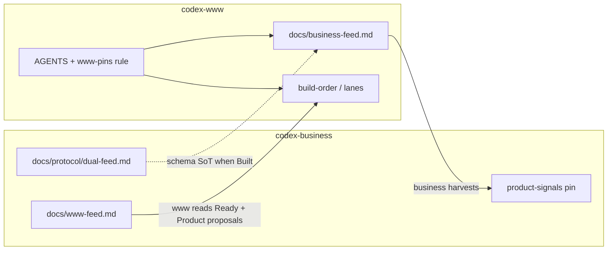

# Dual feed — www half

## Cross-silo chain

| | |
|--|--|
| **Order** | **1. dual-feed-business** → **2. this plan** (aligned 2026-07-20) |
| **This plan** | [`codex-www/.cursor/plans/2026-07-20-dual-feed-www.plan.md`](.cursor/plans/2026-07-20-dual-feed-www.plan.md) |
| **Sibling (business)** | [`codex-business/.cursor/plans/2026-07-20-dual-feed-business.plan.md`](/mnt/DataStore/Ventures/project-codex/codex-business/.cursor/plans/2026-07-20-dual-feed-business.plan.md) |
| **This plan owns** | `docs/business-feed.md`, www AGENTS/rule write habit, www pin refresh on outbound signals, Product-proposals / Ready adoption habit from `www-feed.md` |
| **This plan must not** | Edit `codex-business/`, invent strategy canon, or Build product features P1–P6 |
| **Unlocks** | Business can harvest www signals; product plans can ask-back via a durable feed |
| **Alignment habit** | When contract/schema changes in business, update seed/habits same turn (www-only; do not edit business). |



## Plain English

| | |
|--|--|
| **What this is** | The www-side half of two-way handoff: we already **read** strategy’s `www-feed.md`; now we also **write** a www-owned reverse feed so business sees ships, stumbles, and money-relevant learnings without Brian babysitting. |
| **What you get** | `docs/business-feed.md` + same-turn write habit in AGENTS/rule + pin refresh when outbound signals change. |
| **Why it matters** | Not everything we build goes through strategy chat — but commercial ships and blockers must flow back automatically. |
| **Your part** | Reverse feed is live. In a business session, clear the `www-feed` Ready row for reverse feed and harvest into product-signals. |

## Locked decisions (2026-07-20 full review)

1. **Www owns** [`docs/business-feed.md`](docs/business-feed.md) — business **reads only**.
2. **Business owns** `/mnt/DataStore/Ventures/project-codex/codex-business/docs/www-feed.md` — www **reads only**.
3. **Brian does not maintain feeds** — www updates `business-feed.md` **same turn** on ship / stumble / learning / ask-back; refreshes `.cursor/build-order.md` and `.cursor/lanes.md` when those signals affect pins.
4. **No hub-work-queue clone** — markdown + agent habits only.
5. **Content filter (reverse feed):** user/commercial-meaningful **Shipped**; **Stumbles** that hit cost / rights / timeline / feasibility; **Learnings** that change money or positioning; **Asks-back** to business. Skip routine eng noise (refactors, lint, local DX).
6. **Inbound Product proposals / Ready:** habit-only — read with `www-feed.md`; graduate into www plans when Brian asks. **No** Pending Product proposals mirror table (lanes still mirror).
7. **Seed table columns locked** as in Solution A (section list already matches business sibling; align may still tweak if contract doc differs).
8. **Rule shape:** extend [`.cursor/rules/www-pins.mdc`](.cursor/rules/www-pins.mdc) — one alwaysApply rule; no second file.
9. **Draft landing:** plan lives at the www path above; shipped on build-order 2026-07-20.
10. **Build order:** **1. dual-feed-business** → **2. this plan** (aligned 2026-07-20).

## Problem

Www can ship product-only work. Business has one-way `www-feed.md` and a draft dual-feed contract plan, but www has no outbound feed file and no write habit. Without them, strategy cannot harvest commercial reality.

## Solution

### A. Create `docs/business-feed.md` (implement on Build)

Seed with fixed sections and **locked** table columns (tables start empty except Meta/Changelog):

```markdown
# Product → strategy feed

Www-owned outbound for `codex-business`. Strategy canon stays in business; this file is a curated projection only.
Business reads this path; does not write www.

## Meta
- **Last updated:** YYYY-MM-DD
- **Updated because:** …

## Shipped
| When | What | Why it matters (user/commercial) | Plan / lane |
|------|------|----------------------------------|---------------|
| _(none yet)_ | | | |

## Stumbles
| When | What hit | Impact (cost / rights / timeline / feasibility) | Ask / next |
|------|----------|--------------------------------------------------|-------------|
| _(none yet)_ | | | |

## Learnings
| When | Learning | Money / positioning impact | Suggest business does |
|------|----------|----------------------------|------------------------|
| _(none yet)_ | | | |

## Asks-back
| When | Question for business | Blocks what | Urgency |
|------|----------------------|-------------|---------|
| _(none yet)_ | | | |

## Changelog (short)
- YYYY-MM-DD — Initial reverse feed seeded (empty tables)
```

**Schema source:** Match sibling business plan + (when Built) `codex-business/docs/protocol/dual-feed.md`. If contract wording drifts at align time, update this seed same turn — still do not edit business files from www-only.

### B. AGENTS.md resume + write habit

Extend [AGENTS.md](AGENTS.md):

- **Resume:** keep reading `www-feed.md` before product planning / lane changes; sync Lane proposals → `lanes.md` Pending.
- **Write habit (same turn):** on ship / stumble / learning / ask-back that passes the content filter → append the right section + bump Meta + Changelog; refresh pins if build-order or lanes are affected. Skip writes that fail the filter (no noise rows).
- **Inbound adopt (habit-only):** Product proposals and Ready rows are plan candidates — graduate into `.cursor/plans/` + `build-order.md` when Brian plans them; do **not** mirror a Pending Product proposals table; do not implement P1–P6 inside *this* plan.
- **Must not:** edit `codex-business/`; invent strategy canon into www docs.

### C. Thin alwaysApply rule (extend existing)

Extend [`.cursor/rules/www-pins.mdc`](.cursor/rules/www-pins.mdc) (one thin alwaysApply rule — no second file):

- Outbound: write `docs/business-feed.md` same turn when filter matches; pin refresh as needed.
- Inbound: unchanged feed-read + Lane proposals mirror; Product proposals / Ready = habit-only graduate (no mirror table).
- Must not: write `codex-business/`; dump routine eng noise into the reverse feed.

### D. Pins (draft ceremony — done at landing)

- Listed under **Active / next** in [`.cursor/build-order.md`](.cursor/build-order.md) as open (lane: `foundation`); **do not Build** until Brian aligns with business sibling.
- Upstream: keep strategy-www-feed; note business dual-feed sibling as **draft** (absolute path); Order TBD.
- After **Build** ships: move row to Shipped; ensure `business-feed.md` exists; note for business to clear/update Ready row for reverse feed.

### E. Sibling alignment (Brian + business session)

- Fill Cross-silo **Order** only after Brian asks business to align.
- Business sibling updates its “Sibling (www)” placeholder to this exact path.
- Non-binding hint: business contract schema lock before or with this Build — Brian decides.

## Verification

- [x] `docs/business-feed.md` exists with Meta | Shipped | Stumbles | Learnings | Asks-back | Changelog (locked columns)
- [x] `AGENTS.md` has outbound same-turn write habit + inbound Product proposals / Ready habit-only
- [x] `www-pins.mdc` extended for reverse-feed writes + pin refresh + content filter (thin; no second rule file)
- [x] This plan listed on `.cursor/build-order.md` → Shipped 2026-07-20
- [x] No files under `codex-business/` modified by this Build
- [x] Cross-silo Order locked **1 → 2** (business aligned 2026-07-20)
- [x] P1–P6 not implemented by this Build

## Out of scope

- Editing `codex-business/` (including filling sibling Cross-silo path — business session)
- Inventing strategy canon or answering open pricing/rights questions in www docs
- Implementing Product proposals P1–P6 or new product UI
- Choosing Build order for the dual-feed pair before align
- Hub-work-queue / Python registry
- Stack scaffold / website features
- Pending Product proposals mirror table in www pins

## Build notes

- Write-scope: `codex-www/` only
- Prefer plain git in Ventures when Brian asks to commit
- Mark plan todos done as phases finish
- After ship: move this plan row to Shipped in `build-order.md` same turn; seed Changelog on `business-feed.md`
- After ship: same-turn **note for business** to clear/update `www-feed.md` Ready row for reverse feed (www-only cannot edit business)

## Review notes (2026-07-20 full review — internal)

Cross-check only (no CP1 Bugbot — plan does not touch `scripts/`; no Ventures git root for hub Bugbot gate). Sibling section list matched. Decisions locked from Brian “all recommended” 2026-07-20.

| Topic | Note |
|-------|------|
| Landing | Plan saved to www path; shipped on build-order 2026-07-20 |
| Product proposals | Habit-only — no mirror table |
| Columns | Seed shapes locked |
| Rule | Extend www-pins.mdc |
| Order | **1 → 2** locked (business aligned); this Build shipped |
