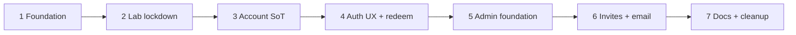

# M1 Account umbrella

## Plain English

| | |
|---|---|
| **What this is** | The master map for **M1 — Account**: seven plans that make signed-in Bookfellow real — identity, lockdown, durable prefs, auth screens, a real admin foundation, invite-by-email, then docs. |
| **What you get** | Sign up (invite-gated) / in / out; sessions + prefs on the server; Create-account redeem field (wire); admin-only queue tools; `/admin` to manage users and credits; email invites from `bookfellow.io`. |
| **Why it matters** | M2+ needs `user_id`, account SoT, and a place ops can grow into a full back-office — not a throwaway lab page. |
| **Your part** | Build **in order**. After Plan 7, run module smoke before calling M1 set and starting M2. |

---

## Also brought in (intake)

| Item | Disposition |
|------|-------------|
| R1 / auth + sessions | **Fold** — Plans 1 + 4 |
| P38 account prefs SoT | **Fold** — Plan 3; per-book stub for M4+ |
| P9 Create-account redeem field | **Fold** — Plan 4 wire; fulfillment M10 |
| Lab queue smoke lockdown | **Fold** — Plan 2 |
| Admin + manual credits | **Fold** — Plan 5 as **Admin foundation V1** |
| Invite email gate | **Fold** — Plan 6 (Brian consult 2026-07-22) |
| P33 public marketing | **Cite** — M12 |
| Full unlock / QR | **Leave** — M10 |
| OAuth / moderator promote UI | **Leave** — later |

---

## What "M1 set" means

Module smoke (lab `:4003`) before Active → M2:

1. Admin mints invite → email arrives → Create account with invite → signed-in shell
2. Sign out → Sign in again; disabled user cannot sign in
3. Session + one account pref survive reload and a second browser (same account)
4. Queue smoke/`/queue` denied for unauthed **and** signed-in non-admin; admin can smoke
5. `/admin`: list users, disable/enable, adjust `companion_credits`
6. Create-account shows redeem field (stored for M10; no unlock yet) **and** requires a valid invite
7. Create without invite (or used/expired invite) fails cleanly

---

## Locked decisions (do not re-litigate mid-chain)

| Topic | Lock | Source |
|-------|------|--------|
| Auth library | **Better Auth** — email/password + DB sessions | Brian + agent |
| Auth schema | **Explicit SQL** in `db/migrations/` matching Better Auth tables + Bookfellow columns (`role`, `disabled_at`, …). Better Auth does **not** own schema. | Full review / consult |
| Auth DB path | Shared **`pg.Pool`** singleton on **`DATABASE_URL` (PgBouncer)** for Better Auth + app queries; migrations stay on `DATABASE_DIRECT_URL` | Plan 1 consult Q1=a |
| Signup display name | Auto from email local-part (Plan 1); polish later in Plan 4 | Plan 1 consult Q2=a |
| OAuth | Google / Apple **after** friends alpha | Brian |
| Roles | **user** or **admin** only; no promote UI | Brian |
| Admin bootstrap | `BOOKFELLOW_ADMIN_EMAILS` env allow-list on create | Brian |
| Admin product | **`/admin` Admin foundation V1** — list/disable/credits now; layout/nav ready for later back-office growth | Consult 2026-07-22 |
| Credits | **`companion_credits` INT** wallet only; admin adjust. **`entitlements`** = per-book unlocks → **M10** | Consult Q1=a |
| Invites | **Required** to create account (Plan 6). Distinct from P9 **redeem** (book unlock wire). | Consult |
| Invite email | **Cloudflare Email Sending** REST from Next; from `invites@bookfellow.io`. API token in `secrets/bookfellow.env`. **Brian enables CF Sending before Build Plan 6.** | Consult #2 Q3=a |
| Invite link URL | **`BOOKFELLOW_APP_URL`** default lab `http://192.168.1.200:4003` for M1 smoke; email always includes **pasteable code**. Remote friends: LAN/VPN or later APP_URL change (Tunnel/public) — no extra plan. | Consult #2 Q1=a |
| Invite vs admin allow-list | After Plan 6 gate: **every** create needs a valid invite. `BOOKFELLOW_ADMIN_EMAILS` only sets `role=admin` on create — **no invite bypass**. Create both admins before flipping the gate. | Consult #2 Q2=a |
| Redeem | Optional field on Create account only; fulfillment M10 | P9 |
| Auth routes | `/sign-in` + `/create-account` | P33 |
| Plan 1 gate UI | Minimal form OK; polish Plan 4 | Full review |
| Signup before Plan 6 | Open create allowed through Plan 5 for lab smoke; **Plan 6 flips gate on** | Chain |
| Schema / DB | SQL migrations; global singleton; rename `__projectCodexDb` in Plan 7 | Stack |
| Mobile-first | Auth + admin + invite UX | Standing |
| Plan SoT | This www umbrella; hub CreatePlan twin stays in sync | Full review |
| **Live-bound product code** | NAS = **lab host only**; app/auth/admin/security code is **production-shaped** and must port to cloud. No throwaway product paths “because lab.” UI polish may still be staged (e.g. Plan 1 forms → Plan 4). | Brian 2026-07-22 |
| Queue page denial | Unauthed → `/sign-in`; signed-in non-admin → **403 page**; API → 401/403. Server layout gate (not client-only). | Plan 2 consult Q1=a |
| Security headers | Plan 2 ships durable **nosniff / referrer / frame** via `next.config`. **No CSP** until public cutover (M12). | Plan 2 consult Q2=b |
| Admin route gate | Shared `requireAdmin()` in Node layouts/API — **not** Edge middleware. Plan 2 `/queue` + Plan 5 `/admin` same pattern. | Plan 2 CP1 / consult |
| Auth secret | Plan 2 **fail-fast** if `BETTER_AUTH_SECRET` unset at runtime (build placeholder only for `next build`). | Brian fold 2026-07-22 |
| Redis lab | Plan 2 **`REDIS_PASSWORD`** → compose `REDIS_URL` + requirepass; **AUTH healthcheck**; keep `127.0.0.1:6379` host publish. | Plan 2 consult revise |

---

## Full review / consult notes (2026-07-22)

- Child plans written this revise (Plans 1–7).
- Intake: five-fold cap — invite email folded into Admin/invite chain add (Plans 5–6) rather than dropping prior folds.
- M11 friends-alpha still owns polish/whitelist product cut; M1 ships the invite+email **mechanism**.

### Full review #2 (post-structure, 2026-07-22) — folded locks

| Topic | Lock (no re-litigate) |
|-------|------------------------|
| Better Auth custom fields | Plan 1 **must** wire `role` + `disabled_at` via Better Auth `additionalFields` / DB hooks (not SQL-only) |
| Disable | Setting `disabled_at` **revokes existing sessions**; middleware rejects disabled on every protected request |
| Credits column | `companion_credits` lives on **user** row |
| Credit adjust | Admin **sets absolute** value (with confirm) |
| Admin audit | Thin `admin_audit` table **required** in Plan 5 |
| Queue page | *(superseded — see Locked decisions “Queue page denial”)* |
| Invite email send | **Live CF send required** to ship Plan 6 gate — no dry-run ship |
| Invite ≠ redeem | Unchanged |

**Still open (AskQuestion #2):** _(none — Brian 2026-07-22: Q1=a lab+code, Q2=a invite required, Q3=a CF before Build 6)_

### Plan 2 full review / consult (2026-07-22) — folded

| Topic | Lock |
|-------|------|
| Non-admin `/queue` | Soft **403** (Q1=a) |
| Headers / CSP | Durable headers only; CSP → M12 (Q2=b) |
| Smoke proof | Cookie-jar curl + browser (Q3=a) |
| Live-bound code | Standing requirement — see Locked decisions |
| Auth secret / Redis | Fail-fast secret + Redis requirepass folded into Plan 2 (Brian 2026-07-22) |

---

## The chain

| # | Plan | Gate before next |
|---|------|------------------|
| 1 | [Foundation](2026-07-22-m1-account-1-foundation.plan.md) | Sign up/in/out; session; role; `disabled_at`; admin env bootstrap |
| 2 | [Lab lockdown](2026-07-22-m1-account-2-lab-lockdown.plan.md) | Queue smoke + `/queue` admin-only; durable headers (no CSP); auth-secret fail-fast; Redis requirepass; 403 for non-admin |
| 3 | [Account SoT](2026-07-22-m1-account-3-account-sot.plan.md) | Prefs + `companion_credits`; hydrate/write; per-book stub |
| 4 | [Auth UX + redeem](2026-07-22-m1-account-4-auth-ux-redeem.plan.md) | Mobile `/sign-in` + `/create-account`; redeem field wire |
| 5 | [Admin foundation V1](2026-07-22-m1-account-5-admin-foundation.plan.md) | `/admin`: users, disable, credits; shell for invites nav |
| 6 | [Invites + email](2026-07-22-m1-account-6-invites-email.plan.md) | Mint+send invite email; create-account gated; admin Invites UI live |
| 7 | [Docs + cleanup](2026-07-22-m1-account-7-docs-cleanup.plan.md) | Module smoke green; docs; pins; business-feed; umbrella done |

**Serial Build only.** Living-plan: decision changes update umbrella + affected children same turn.

---

## Out of M1 (forward refs)

| Item | Where |
|------|-------|
| Rail / Appearance / Settings UI | M2 |
| Library / eligibility / covers | M3 |
| Per-book state | M4–M8 |
| Redeem/QR fulfillment + spend credits | M10 |
| Friends-alpha product polish | M11 (mechanism ships in Plan 6) |
| Public marketing | M12 |
| Stripe SKUs | M13 |
| OAuth / moderator / full CMS admin | Later |

---

## Habit

- Flip umbrella todo when each child ships
- Update [`.cursor/build-order.md`](../build-order.md) same turn on create/ship
- Reverse feed on module ship (Plan 7)
- Do not invent Ready rows on business `www-feed.md`
