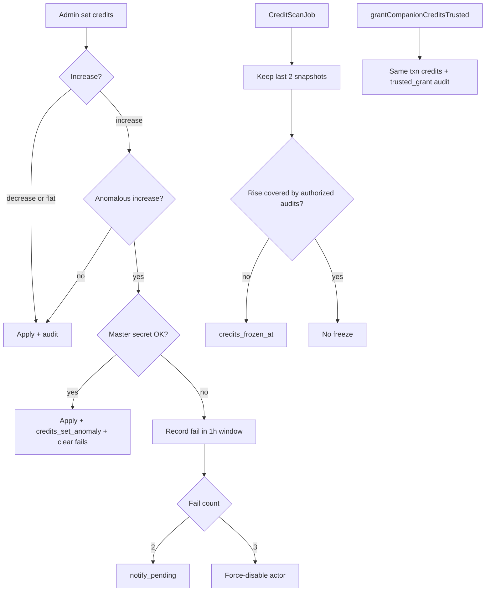

# M1 Account — Plan 5b: credit security enhance

Chain: [umbrella](2026-07-22-m1-account-umbrella.plan.md) · prev: [admin foundation](2026-07-22-m1-account-5-admin-foundation.plan.md) · next: [invites + email](2026-07-22-m1-account-6-invites-email.plan.md)

**This plan = #5b of 8** (serial: 1–5 → **5b** → 6 → 7).

## Plain English

| | |
|---|---|
| **What this is** | Security harden on the admin/credits work already live — not a new product surface. |
| **What you get** | Renamed off-site master secret; large credit **increases** need that secret (3 strikes / 1h); scan freezes unexplained drips; purchases/redeems use a trusted path that never false-freezes users. |
| **Why it matters** | Plan 6 invites + Plan 7 docs/smoke should not land on a half-finished credit exploit posture. |
| **Your part** | Rename key in `secrets/bookfellow.env` (same value OK); no website control for the secret. |

## Also brought in (intake)

| Item | Disposition |
|------|-------------|
| Backlog Admin credit / master-secret needs (Brian 2026-07-23) | **Fold** — this plan |
| Q locks 1a / 2a / 3a | **Fold** — actor lock; increases only; email via Plan 6 |
| Rename → `BOOKFELLOW_ADMIN_MASTER_SECRET` (Brian a) | **Fold** |
| Scan job 15m / 240m alpha + drip + freeze | **Fold** |
| Trusted grant / bundle bypass | **Fold** — stub + **hard** same-txn audit |
| Unlock freeze in `/admin` | **Fold** |
| Plan 6 CF email notify | **Cite** — stub now; Plan 6 wires send |
| M13 bundles / SKUs | **Leave** |
| Plan 5 admin (shipped) | **Cite** — enhance in place |

## Locked decisions

| Topic | Lock |
|-------|------|
| Secret name | **`BOOKFELLOW_ADMIN_MASTER_SECRET`** (NAS secrets only). Migrate from `BOOKFELLOW_ADMIN_PEER_DISABLE_SECRET` (fallback once, then drop). |
| Bad anomalous **increase** | Require master secret. Valid → apply + audit + clear fail window. Invalid → **no credit change**; count fail. |
| Failed secret attempts | Within **1 hour**: fail **2** → `admin_notify_pending` (email via Plan 6); fail **3** → **force-disable + revoke actor**. Success or 1h expiry clears window. |
| Decreases | No master secret. |
| Email | `admin_notify_pending` now; **Plan 6** CF send. |
| Freeze | `credits_frozen_at` — blocks **increases**; admin **decreases** OK. ≠ `disabled_at`. |
| Scan cadence | BullMQ: **15 min** default; **240 min** if `BOOKFELLOW_PRODUCT_PHASE=alpha`. Register **idempotent on worker boot**. |
| Snapshot prune | Keep **last 2** per user. |
| Drip / unauthorized rise | Freeze iff `current - previous - sum(authorized_deltas) > 0`. |
| Authorized rises (hard) | Only `credits_set`, `credits_set_anomaly`, `credits_trusted_grant`. Purchases / redeem fulfill / bundles / allotments **must** call `grantCompanionCreditsTrusted` and write that audit **in the same DB transaction** as the balance bump. No silent `UPDATE companion_credits`. Tests enforce. Prevents false user freezes from bad programming. |
| Trusted bypass | Server-only helper; bypasses freeze; admin absolute-set does **not** use it. |
| Clear freeze | `/admin` + master secret. |
| Scan job claim | No Gemini / `job_claims`. |
| First scan | Baseline only (no freeze). |
| Actor punitive lock | Force-disable **bypasses** self-disable guard. |
| Anomaly gate | **Increase-only**. |

## Scope

**In:** rename; interactive harden + 1h fail counter; migration `006`; scan job + worker-boot schedule; trusted grant helper; notify stub; pins + Plan 6 prev → 5b.

**Out:** CF email send (Plan 6); invite gate; Stripe SKUs (M13); promote UI; CSP.

## Design

1. **Rename** — `BOOKFELLOW_ADMIN_MASTER_SECRET`; shared by peer-admin disable + anomalous increase.
2. **Interactive** — master secret for anomalous increases; 2 fails → notify; 3 / 1h → force-disable actor.
3. **Freeze** — increases blocked; decreases allowed; clear with secret.
4. **Snapshots** — last 2 per user.
5. **Job** — worker-boot repeatable; coverage math for freeze.
6. **Trusted** — transactional helper; mandatory for all product grants later.
7. **Notify stub** — Plan 6 wires CF.
8. **Pins** — umbrella / build-order / backlog; Plan 6 prev → 5b.

## Acceptance

- Renamed env key live; old unused after migrate
- Wrong secret: no credit change; notify at 2; force-disable at 3 within 1h
- Decrease needs no master secret; success clears fail window
- Frozen: no increases; decreases OK; clear with secret
- Scan freezes only uncovered rises; trusted same-txn grant never false-freezes
- Worker schedules scan; Plan 6 owns live email

## Full review / consult (Plan 5b — 2026-07-23)

| Topic | Lock |
|-------|------|
| Job register | Worker boot (Q1=a) |
| Failed secret | 3 / **1h**; email at **2** (Q2=c+) |
| Snapshot prune | Last 2 (Q3=a) |
| Scan freeze | Uncovered rise > 0; trusted path hard (Q4=a+) |
| CP1 | Force-disable bypass; increase-only; freeze = grants only |

## Habit

Flip umbrella `chain-5b-credit-security` on ship; then Build Plan 6.

## Shipped (2026-07-23)

Live lab: `bookfellow-web:p5b` / `bookfellow-worker:p5b`. Migration `006` applied. Worker: `credit.scan schedule registered every_ms=14400000 phase=alpha` + first scan `frozen: 0`. Ready 200; `/admin` unauth 307; freeze/credits APIs 401 unauth. CP2: no product blockers.
