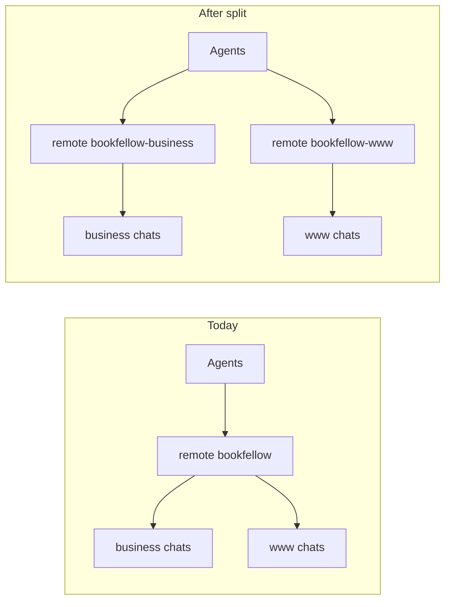

# Split Bookfellow into two git repos

## Why moves failed (root cause)

Glass **Repositories** groups chats by **git remote URL**, not workspace folder. Both silos sit under one remote (`https://github.com/brian-wenger-atx/bookfellow.git`), so every agent lands under **bookfellow**. `move_agent_to_root` only changes the local workspace root — it cannot invent a second remote. That is why Alpha → www still stayed under **bookfellow**.

## Locked decisions

| Choice | Lock |
|--------|------|
| New remotes | `brian-wenger-atx/bookfellow-business` + `brian-wenger-atx/bookfellow-www` (private) |
| Old remote | Archive `brian-wenger-atx/bookfellow` with pointer README (no delete) — **after** both silo pushes verify |
| Disk layout | Keep `/mnt/DataStore/Ventures/bookfellow/{bookfellow-business,bookfellow-www}`; parent **non-git** (`.git` → `.git-monorepo-archive`, gitignore) |
| History | **Locked (Brian 2026-07-23):** commit dirty tree on monorepo `main` (no secrets), then `git subtree split` per silo |
| Tooling | Move husky hooks + **`husky` devDependency** + `prepare`/`gen:queue` into **www** only |
| Bugbot | Dual `GIT_ROOTS` (`bookfellow-www` + `bookfellow-business`); fix `classify_path` + self-test; create business `bugbot-ventures.mdc`; **same turn** as silo `.git` materialization |
| Old Agents chats | Leave under **bookfellow**; new work opens under the two remotes |
| Daily open | Multi-root both silos (`bookfellow-silos.code-workspace`) |

## Cutover steps (Build)

1. **Dirty tree:** commit dirty+untracked on monorepo `main` (no secrets). Do not subtree-split until that lands.
2. **GitHub:** create private `bookfellow-business` + `bookfellow-www` via API (`GITHUB_TOKEN`).
3. **Bugbot gate (same turn as silo `.git`):** update [`hub_bugbot_gate.py`](/mnt/DataStore/home/agent/scripts/hub_bugbot_gate.py) — dual `GIT_ROOTS`, `classify_path`, self-test; www [`bugbot-ventures.mdc`](.cursor/rules/bugbot-ventures.mdc); **create** `bookfellow-business/.cursor/rules/bugbot-ventures.mdc`.
4. **Split:** `git subtree split` per silo; materialize each silo `.git`; `main` → new `origin`; push both.
5. **Retire parent git:** rename monorepo `.git` → `.git-monorepo-archive` only after both pushes OK; gitignore archive.
6. **Www tooling:** move `.husky/`, `prepare`/`gen:queue`, and **husky dep** into www; fix hook paths; `pnpm install`.
7. **Docs:** parent `GIT.md`/`README.md`; www + business `docs/git.md`; hub `AGENTS.md` + changelog; reverse-feed skip.
8. **Archive** old GitHub `brian-wenger-atx/bookfellow`.
9. **Agents (Brian):** reopen multi-root `bookfellow-silos.code-workspace`. Leave old chats under **bookfellow**.

## Verify

- Distinct remotes on each silo; parent has no live `.git`.
- Bugbot preflight accepts both silo roots; www CP1 → `Full Repository Path: …/bookfellow-www`.
- Agents **Repositories** shows two top-level entries after opening silos.

## Intake

- **Considered / folded / left:** see frontmatter.

## Also brought in (intake)

- Dirty-tree strategy, atomic Bugbot gate, husky dep, business bugbot rule — required for a safe cutover.
- No product Ready items.

## Full review 2026-07-23 (internal)

**CP1 Bugbot:** 5 findings (3 high / 2 medium) — recorded `bugbot-task:76bdf933`. Folded into cutover order above.

**Cross-check:** dirty tree; husky dep; classify/self-test; canonical plan = this www path (hub CreatePlan twin is not Bugbot SoT).
