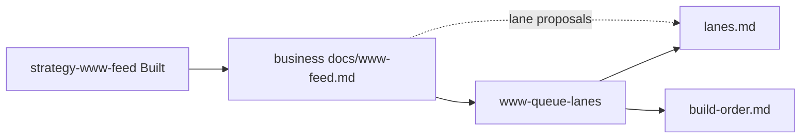

# Www queue + lanes pins

## Cross-silo chain

| | |
|--|--|
| **Order** | **1. strategy www feed** → **2. this plan** |
| **Sibling (upstream)** | [`codex-business/.cursor/plans/2026-07-20-strategy-www-feed.plan.md`](/mnt/DataStore/Ventures/bookfellow/bookfellow-business/.cursor/plans/2026-07-20-strategy-www-feed.plan.md) |
| **Depends** | Strategy www-feed **Built** — `codex-business/docs/www-feed.md` exists (confirmed 2026-07-20) |
| **This plan owns** | `.cursor/build-order.md`, `.cursor/lanes.md`, www AGENTS/rule for pins + feed-read |
| **This plan must not** | Edit `codex-business/` strategy canon or invent strategy into www docs |
| **Alignment habit** | Read sibling plan + `codex-business/docs/www-feed.md` before Build. If feed contract (sections / Ready / lane proposals) changed, align pin seed and this plan’s Depends same turn. When this plan’s pin contract changes, update sibling Cross-silo chain if business silo (or Ventures root) is in write scope — else note drift for the business session. |

**Sequence SoT after this Build:** `.cursor/build-order.md` (this silo). Strategy signal SoT remains `codex-business/docs/www-feed.md`. No shared registry / no hub-work-queue clone.



## Plain English

| | |
|--|--|
| **What this is** | The www-side “pins” so product agents know build order and website lanes — without copying the strategy vault here. |
| **What you get** | `build-order.md` + `lanes.md` under `.cursor/`, plus short AGENTS/rule habits. |
| **Why it matters** | Business ships the feed first; this plan turns that handoff into www-owned queue and lane taxonomy. |
| **Your part** | Upstream feed is already Built. Say **Build** on this plan when ready (www silo). |

## Locked decisions (2026-07-20 full review)

1. **Starter lanes:** Seed four at Build — foundation, security, user-control, ai-module (starters; taxonomy may still change).
2. **Upstream paths:** Absolute Ventures paths only in `build-order.md` Upstream section.
3. **Lane column:** Optional `Lane` column on Active / Queued / Shipped rows.
4. **Adoption echo:** When www adopts a feed lane proposal, same-turn habit — note for a business session to mark feed status `adopted in www` (www still does not edit `codex-business/` from a www-only workspace).

## Locked context (do not re-litigate)

- Pins live only under `codex-www/.cursor/`: `build-order.md`, `lanes.md`, `plans/`
- Agents update pins **same-turn** (markdown only — no Python work-queue)
- Business must not edit www; www must not own strategy canon
- Feed lane names are **proposals** until adopted into `lanes.md`
- Ideas backlog stays in business; only **Ready for planning** feed items become www plan candidates

## Problem

Www has no pin files yet. Without them, product planning has nowhere to record lanes or build order. Strategy will land direction in `www-feed.md`; www needs a durable, agent-maintained place to adopt lanes and sequence Builds.

## Solution

Create two pins + thin agent guidance:

1. **`.cursor/lanes.md`** — adopted website lanes (taxonomy evolves; not locked forever)
2. **`.cursor/build-order.md`** — what we build and in what order (agent-maintained)
3. **AGENTS + rule** — read feed before product planning; update pins same-turn; never write business vault

## `lanes.md` (implement on Build)

Starter shape (headings fixed; lane list editable over time):

```markdown
# Website lanes

Adopted lanes for Project Codex www work. Taxonomy may change — add/remove/rename with a one-line why.

Strategy may **propose** lanes in `codex-business/docs/www-feed.md`. A proposal is not adopted until it appears here.

| Lane | Purpose | Notes |
|------|---------|-------|
| foundation | App shell, routing, shared UI primitives | starter |
| security | Auth, secrets boundaries, abuse controls | starter |
| user-control | Account, preferences, ownership/metering UX | starter |
| ai-module | Companion packs, generation, recall flows | starter |

## Pending proposals (from www-feed)

<!-- Copy proposed lane names here until adopted or dropped; then delete the row. -->

| Proposed | Source | Status |
|----------|--------|--------|
| _(none)_ | | |
```

**Defaults:** Seed the four starter lanes above (locked 2026-07-20). Do **not** invent extra lanes from backlog stubs. If `www-feed.md` lists lane proposals at Build time, put them under Pending proposals (or adopt if Brian says so in-chat). On adopt: update this table, clear/update Pending row, and leave a same-turn note for business to mark the feed proposal `adopted in www`.

## `build-order.md` (implement on Build)

Starter shape:

```markdown
# Build order (codex-www)

Agent-maintained. Update same-turn when a plan is created, reordered, Built, or shipped.
No hub-work-queue Python clone.

## Upstream (other silo)

| Plan | Path | Status |
|------|------|--------|
| strategy-www-feed | `/mnt/DataStore/Ventures/bookfellow/bookfellow-business/.cursor/plans/2026-07-20-strategy-www-feed.plan.md` | built |
| Strategy feed doc | `/mnt/DataStore/Ventures/bookfellow/bookfellow-business/docs/www-feed.md` | must exist before product plans from Ready |

## Active / next (this silo)

| Order | Plan | Lane | Path | Status |
|------:|------|------|------|--------|
| 1 | www-queue-lanes | foundation | `.cursor/plans/archive/2026-07-20-www-queue-lanes.plan.md` | closed / archived 2026-07-21 |

## Queued

_(empty until Ready feed items graduate into www plans)_

## Shipped

_(move rows here when done)_

## Habit

- New www plan → add to Queued or Active same turn (Lane optional; leave blank if unclear)
- Before planning from strategy → read `www-feed.md` Ready + Priorities
- Lane changes → update `lanes.md` same turn; if adopting a feed proposal, note it for a business session to mark feed `adopted in www` (www-only workspace does not edit the feed)
```

**Path note:** Upstream table uses **absolute** paths only (locked 2026-07-20). Cross-silo chain blocks on plans also keep absolute sibling links.

## Agent / rule changes (this silo)

### `AGENTS.md`

- Resume: read `/mnt/DataStore/Ventures/bookfellow/bookfellow-business/docs/www-feed.md` before product planning / lane changes.
- Habit: update `.cursor/build-order.md` and `.cursor/lanes.md` same-turn when plans or lanes change.
- Habit: when adopting a feed lane proposal → note for business to mark feed `adopted in www`.
- Must not: edit `codex-business/` strategy canon from a www-only workspace.

### New rule (thin)

e.g. `.cursor/rules/www-pins.mdc` (`alwaysApply: true`):

- Pins = `.cursor/build-order.md` + `.cursor/lanes.md`
- Same-turn updates; markdown only
- Read www-feed before product planning (absolute business path)
- Never edit `codex-business/` from www-only
- Adopt lanes explicitly into `lanes.md`; feed proposals are not lanes until adopted
- On adopt from feed: note for business session to mark feed status

## Out of scope (this plan)

- Building product website / stack scaffold
- Editing or creating `codex-business/docs/www-feed.md` (upstream plan)
- Graduating backlog ideas without Brian / feed Ready
- Hub-work-queue / Python registry
- Locking lane taxonomy forever

## Acceptance criteria

- [x] Upstream strategy-www-feed is Built (or Build blocked with a clear note until it is)
- [x] `.cursor/lanes.md` exists with starter lanes + pending-proposals table
- [x] `.cursor/build-order.md` exists with Upstream + Active/Queued/Shipped and this plan listed
- [x] `AGENTS.md` has feed-read + same-turn pin habits + never-edit-business
- [x] Thin www pins rule exists
- [x] No strategy canon files under `codex-business/` modified by this Build (read-only ok)

## Build notes

- Write-scope: `codex-www/` only
- Prefer plain git in Ventures when Brian asks to commit
- Mark plan todos done as phases finish
- After ship: move this plan row to Shipped in `build-order.md` same turn

## Review notes (2026-07-20 full review — internal)

Cross-check only (no CP1 Bugbot — plan does not touch `scripts/`; no Ventures git root for hub Bugbot gate). Sibling strategy-www-feed is Built; `www-feed.md` + cursor-shared handoff paragraph exist; feed Lane proposals empty; Ready empty. Folded path fix: Alignment habit / Resume must cite `codex-business/docs/www-feed.md` (not silo-local `docs/`). Open decisions → AskQuestion / Consult; lock into plan body after answers.

| Topic | Note |
|-------|------|
| Upstream Depends | **Satisfied** — feed file present |
| Sibling contract | Aligned (mutual links, www owns pins, feed owns strategy signal) |
| Starter lanes | **Locked:** seed four starters |
| Upstream path style | **Locked:** absolute only |
| Lane column | **Locked:** optional on build-order rows |
| Adoption echo | **Locked:** note for business to mark feed adopted |
| Pending proposals table | Keep — mirrors feed without www writing business |
| Stack / product plans | Still out of scope; Queued stays empty until Ready graduates |
