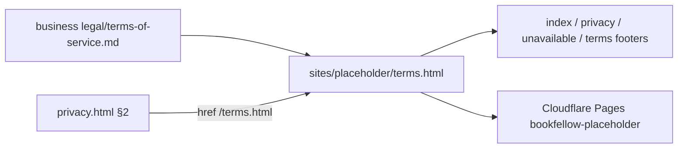

# Professional Terms page (bookfellow.io)

**Shipped 2026-07-21** — https://bookfellow.io/terms.html (Cloudflare Pages).

Feed **P27** — [legal/terms-of-service.md](file:///mnt/DataStore/Ventures/bookfellow/bookfellow-business/docs/legal/terms-of-service.md). Mirror shipped [privacy-page-professional](.cursor/plans/archive/2026-07-21-privacy-page-professional.plan.md) chrome; no new layout system.

## Decisions (locked from privacy + business apply notes)

| Decision | Choice |
|----------|--------|
| Layout | Reuse `shell-policy` + sticky/mobile TOC + prose from [`styles.css`](sites/placeholder/styles.css) — no Terms-only CSS beyond a comment rename to “Policy pages” |
| Copy re-sync | **Manual** — publish §1–§20 + both date lines only; strip INTERNAL / Www apply notes. Render script stays deferred (same as privacy backlog) |
| Intro | Short synthesized lede before §1 (agreement + Privacy link) |
| Dates | Effective **May 14, 2026** · Last updated **July 21, 2026** |
| Scope | Terms page + footers + Privacy §2 link — **not** P26 (waitlist already on index) |

## What ships

### 1. [`sites/placeholder/terms.html`](sites/placeholder/terms.html) (new)

Same skeleton as [`privacy.html`](sites/placeholder/privacy.html):

- `shell shell-policy`, Instrument Serif + Figtree, canonical `https://bookfellow.io/terms.html`
- Title / meta: Terms of Service — Bookfellow
- Header: back link, **Terms of Service**, both date lines, synthesized intro
- TOC (20 anchors) + `<article class="prose">` sections **1–20** from business draft
- Preserve load-bearing **§7** wording (life of Service + ~3-month wind-down — not “forever”)
- ALL-CAPS warranty / liability blocks (§13–§14) as normal `
` prose (match privacy professionalism; no decorative callout cards)
- Footer: support · Privacy · **Terms** (`aria-current="page"` on Terms)

**Strip / do not publish:** HTML comments below the divider, Www apply notes, vendor/stack/SKU/geo internals.

### 2. Footers + Privacy cross-link

Add `· Terms` → `/terms.html` on:

- [`index.html`](sites/placeholder/index.html)
- [`privacy.html`](sites/placeholder/privacy.html)
- [`unavailable.html`](sites/placeholder/unavailable.html)
- `terms.html` (self)

On [`privacy.html`](sites/placeholder/privacy.html) §2: turn “Terms of Service” into `<a href="/terms.html">Terms of Service</a>` (closes the promised separate ToS hole).

### 3. Verify + deploy + feeds

- Local `python3 -m http.server` at 375px + 1280px: TOC anchors, mobile details TOC, footer parity, banned-copy scan (no “forever” / first-mover claims)
- Deploy: `npx wrangler pages deploy . --project-name=bookfellow-placeholder --branch=main` from `sites/placeholder` (manual if CF auth missing)
- Same-turn: [`docs/business-feed.md`](docs/business-feed.md) Shipped row for P27; [`.cursor/build-order.md`](.cursor/build-order.md) Queued → Shipped under `placeholder-site`; note business to mark feed P27 `adopted in www`

## Out of scope

- P26 waitlist CTA (already on lander)
- Automating md→HTML render
- Counsel entity/arbitration polish (§18 Texas lean stays as drafted)
- Next.js lab app / product ToS surfaces